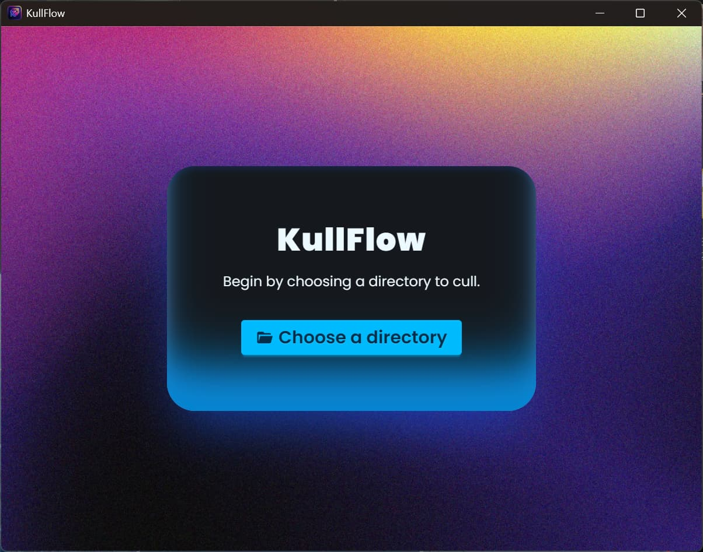
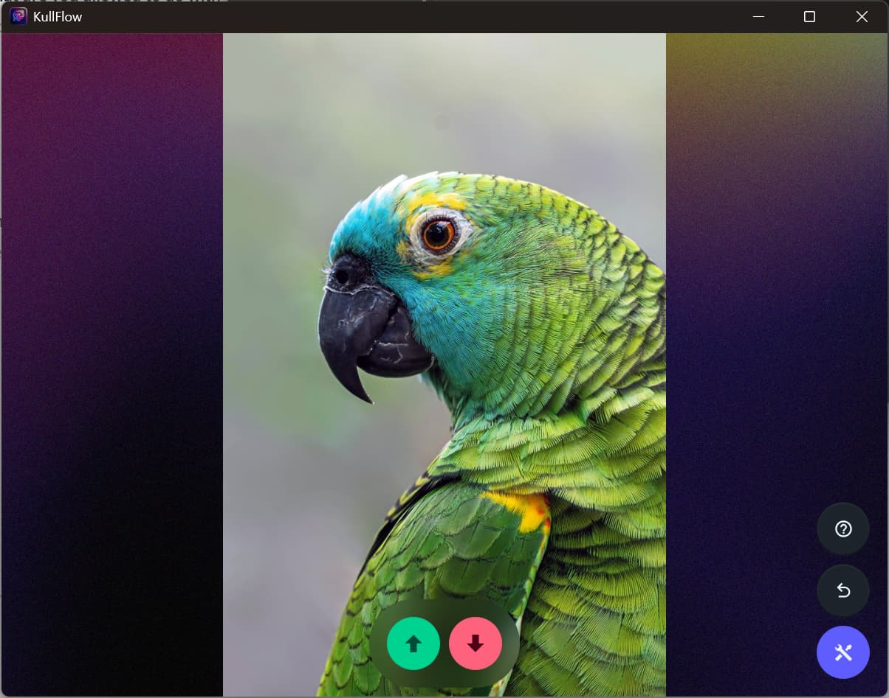

# KullFlow

KullFlow is a simple image culler / remover built in Tauri. Use it to quickly iterate through a directory with images and choose which ones you want to keep and which to get rid of.

## Features

WARNING! This software is currently in development and there is currently no release (either testing or stable) available. However, here are the features that are finished / in the works:

- Delete unwanted images quickly.
- Optimized image resizing and caching.
- Easy-to-navigate UI.
- Multi-platform - tested on Windows 11 and Linux.

## Screenshots (WIP)

